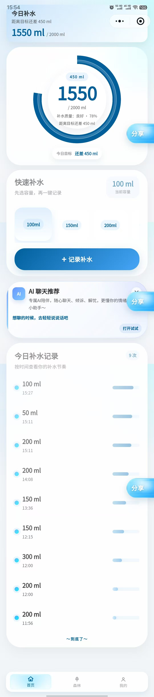
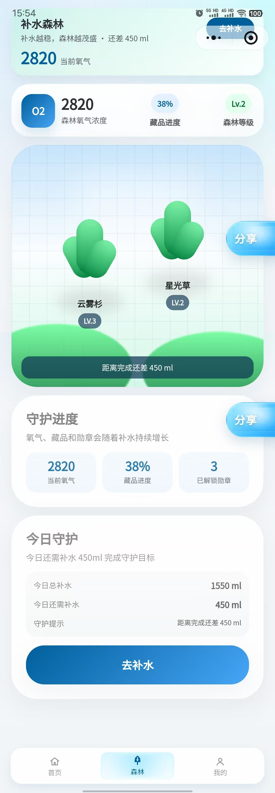
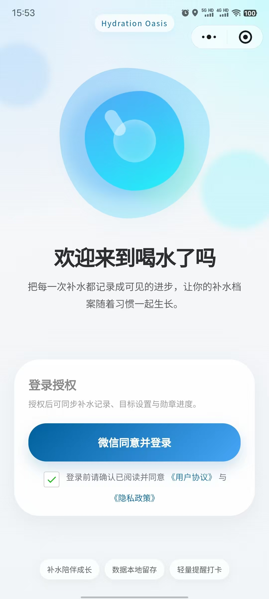
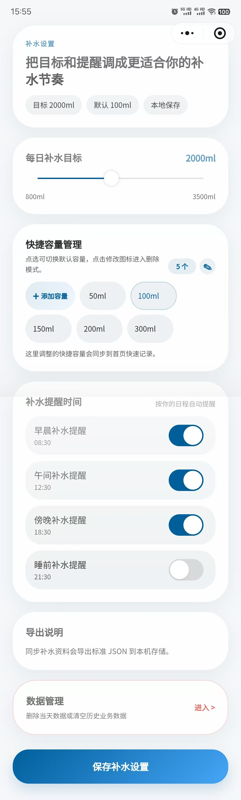
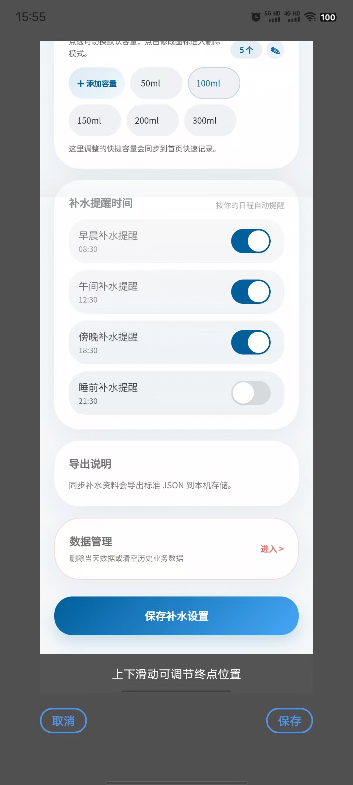
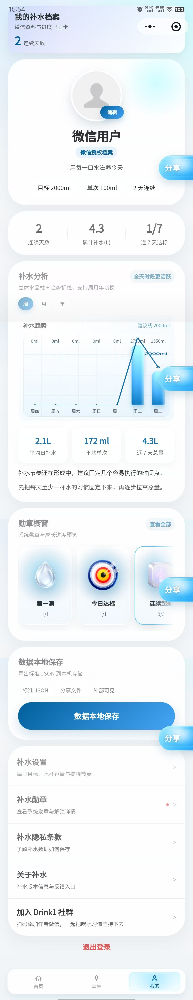

# 喝水了吗 / Drink1

<p align="center">
  
  
  
  
  
</p>

<p align="center">
  A polished, local-first hydration tracker built for the WeChat Mini Program ecosystem.
  <br />
  一款面向微信小程序生态的本地优先补水记录应用，围绕「记录、提醒、成长、分享」构建完整的习惯闭环。
</p>

## Overview

Drink1 is designed for users who want hydration tracking to feel lightweight, continuous, and rewarding. It turns daily water intake into a clear feedback loop: record, remind, grow, and share.

喝水了吗 面向的是希望把补水习惯真正坚持下去的人。它把每一次饮水记录、每日目标、提醒节奏、连续打卡和成长勋章整合在一起，让“喝水”不再只是一个动作，而是一条可见、可回顾、可分享的习惯路径。

## Quick Navigation

- [Overview](#overview)
- [Product Flow](#product-flow)
- [Highlights](#highlights)
- [Architecture](#architecture)
- [Getting Started](#getting-started)
- [Versioning & Release](#versioning--release)
- [Data & Privacy](#data--privacy)
- [Repository Layout](#repository-layout)
- [Contributing Notes](#contributing-notes)
- [Open Source Policy](#open-source-policy)
- [GitHub Home Setup](#github-home-setup)

## Product Flow

The screenshots below follow the natural user journey, from first entry to daily use and secondary actions.

下面的截图按照真实业务流程排序：从首次进入、日常补水、数据分析，到设置与联系入口，完整展示核心使用路径。

### 1. Login

入口授权页，承接首次进入时的身份确认与产品主视觉。


### 2. Home

首页是每日使用的主战场，集中承载今日目标、快捷容量、快速记录和进度反馈。



### 3. Forest

森林页把补水进度转化成可视化成长氛围，强化“坚持就会看见变化”的产品感受。



### 4. Profile

个人中心汇总补水统计、图表分析、勋章成就和资料入口，是用户回看成长轨迹的核心页面。



### 5. Settings

设置页负责每日目标、提醒节奏、快捷容量和数据管理，是补水策略的统一控制台。



### 6. Settings Sheet

设置弹层展示了更深一层的交互状态，保留了沉浸式体验和安全确认流程。



### 7. Contact Dialog

联系弹窗用于作者联系和社群加入，承接分享、反馈和用户连接场景。



## Highlights

- **Local-first data model / 本地优先的数据模型**  
  Hydration records, settings, quick amounts, medals, and profile state live in WeChat storage by default for a fast and private experience.
- **Habit loop centered UX / 习惯闭环体验**  
  Quick logging, reminder scheduling, streak tracking, and medal progression work together to keep feedback immediate and motivating.
- **Mini-program architecture with clear boundaries / 架构边界清晰**  
  Pages handle user journeys, reusable modules live in `components/`, and `utils/store.js` serves as the single source of truth for hydration state.
- **Share and contact ready / 分享与联系能力齐备**  
  Built-in share actions, a floating share entry, and a contact flow make the product easy to spread and easy to revisit.
- **Privacy-aware product language / 隐私友好的产品表达**  
  The copy consistently emphasizes local persistence and minimal exposure, which aligns well with consumer-facing mini-program expectations.

## Architecture

The repository is organized around a clean WeChat Mini Program structure:

仓库采用清晰的微信小程序分层方式组织，职责边界明确，便于继续扩展和维护：

- `pages/` - user-facing journeys such as home, forest, profile, settings, privacy, and about
- `components/` - reusable interaction modules like the share FAB, navigation bar, dialogs, and quick-amount manager
- `custom-tab-bar/` - custom bottom navigation for the main app shell
- `utils/store.js` - hydration state, derived metrics, medal evaluation, and local persistence
- `utils/copy.js` - centralized product copy and screen text
- `utils/medals.js`, `utils/water.js`, `utils/home.js` - domain logic for medals, hydration math, and home view models
- `scripts/` - regression checks and smoke tests used during development
- `docs/readme/` - screenshot assets used by this README

## Getting Started

1. Open the repository in WeChat DevTools.
2. Compile the project with the mini-program runtime.
3. If needed, provide your own `appid` for platform capabilities such as login, sharing, and device-specific behaviors.

The project is intentionally lightweight and does not rely on an extra frontend build pipeline.

项目本身保持轻量，不依赖额外前端构建链，适合直接在微信开发者工具中打开、调试和迭代。

## Versioning & Release

This repository follows a simple GitHub-friendly release model:

本仓库采用轻量但标准的发版方式：

- `main` is the stable release branch.
- `dev` is the integration branch for completed work.
- `feature/*` branches are used for isolated development.
- Semantic version tags such as `v0.1.0` trigger GitHub Releases automatically.
- See the full policy in [docs/branching-release.md](docs/branching-release.md).

## Data & Privacy

- Hydration records, settings, medals, and profile state are stored locally by default.
- This repository does not ship with a backend service.
- If cloud sync or account services are introduced later, update the privacy notice and product copy together.

## Repository Layout

```text
.
├── app.js / app.json / app.wxss
├── components/
├── custom-tab-bar/
├── docs/readme/
├── pages/
├── scripts/
└── utils/
```

## Contributing Notes

- Update shared copy in `utils/copy.js` before duplicating text in page files.
- Keep reusable interaction logic in `components/` when multiple pages need it.
- Treat `utils/store.js` as the source of truth for hydration state and derived summaries.
- Store future README assets under `docs/readme/` so the documentation stays stable and portable.
- See [CONTRIBUTING.md](CONTRIBUTING.md) for the branching model, PR expectations, and release checklist.

## Open Source Policy

- [CONTRIBUTING.md](CONTRIBUTING.md) explains how to branch, merge, and release.
- [CODE_OF_CONDUCT.md](CODE_OF_CONDUCT.md) describes the standards for respectful participation.
- [CHANGELOG.md](CHANGELOG.md) tracks notable changes and semantic releases.
- [SECURITY.md](SECURITY.md) explains how to report security issues privately.

## GitHub Home Setup

This repository includes a few GitHub-native files to make the project page feel complete and ready for collaboration:

- `.github/FUNDING.yml` for the sponsor entry
- `.github/PULL_REQUEST_TEMPLATE.md` for focused pull requests
- `.github/ISSUE_TEMPLATE/` for structured bug reports and feature requests
- `.github/workflows/release.yml` for tag-driven releases
