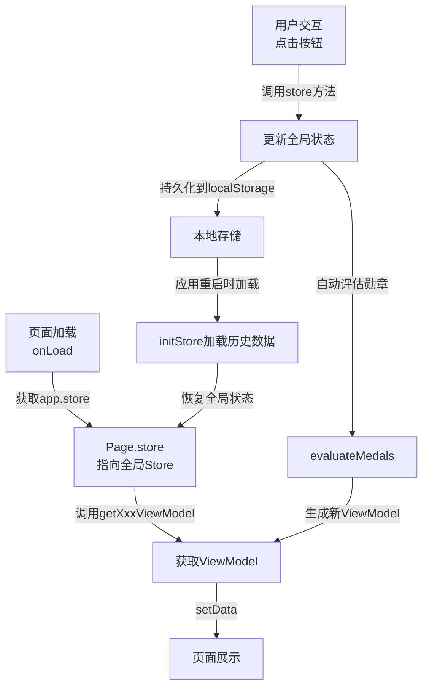

# "喝水了吗"微信小程序 - 需求规格说明书

**项目名称**: 喝水了吗 (Drink1)  
**项目类型**: 微信小程序（健康饮水记录与激励平台）  
**编写日期**: 2026-03-31  
**版本**: 1.0

---

## 目录

1. [项目概览](#项目概览)
2. [产品定位](#产品定位)
3. [核心功能需求](#核心功能需求)
4. [用户故事](#用户故事)
5. [页面功能详述](#页面功能详述)
6. [数据结构与存储](#数据结构与存储)
7. [业务规则](#业务规则)
8. [成就系统](#成就系统)
9. [技术架构](#技术架构)
10. [非功能性需求](#非功能性需求)

---

## 项目概览

### 1.1 项目简介

"喝水了吗"是一款帮助用户记录每日饮水情况、追踪饮水进度、通过勋章与成就系统激励用户建立良好饮水习惯的微信小程序。

### 1.2 核心价值主张

- **记录便捷** - 一键快速记录饮水，支持自定义饮水量
- **实时反馈** - 即时展示每日目标进度和剩余目标量
- **成长激励** - 通过连续天数、勋章系统等多维度激励用户坚持
- **数据管理** - 个人资料编辑、饮水设置自定义、连续天数追踪
- **隐私优先** - 所有数据本地存储，支持用户隐私控制

### 1.3 设的用户群体

- 想要改善饮水习惯的成年人
- 关注个人健康的用户
- 喜欢被激励和追踪进度的用户

---

## 产品定位

### 2.1 应用场景

- **日常场景**: 工作中、喝水时快速记录饮水量
- **反思场景**: 查看每日/累计饮水数据，了解自己的饮水习惯
- **激励场景**: 查看勋章进度、连续天数，增强坚持动力
- **设置场景**: 自定义每日目标、快速按钮、提醒时间

### 2.2 用户旅程

```
打开小程序 → 登录（可选） → 记录饮水 → 查看进度 → 查看勋章/成就 → 调整设置
```

---

## 核心功能需求

### 3.1 功能清单

| 功能模块 | 功能描述 | 优先级 | 状态 |
|---------|---------|--------|------|
| 饮水记录 | 快速记录饮水，支持预设和自定义数量 | P0 | ✓ |
| 每日进度 | 展示每日饮水进度、剩余目标 | P0 | ✓ |
| 连续追踪 | 记录并展示连续达标天数 | P0 | ✓ |
| 勋章系统 | 8个勋章，根据不同条件解锁 | P0 | ✓ |
| 个人资料 | 用户昵称、头像、座右铭管理 | P1 | ✓ |
| 饮水设置 | 设置每日目标、快速按钮量、提醒等 | P1 | ✓ |
| 数字森林 | 根据饮水量展示成长进度和"氧气值" | P1 | ✓ |
| 微信登录 | 支持微信用户信息授权（可选） | P2 | ✓ |
| 数据同步 | 会话心跳同步，支持数据持久化 | P1 | ✓ |
| 隐私说明 | 展示数据使用与隐私政策 | P1 | ✓ |

### 3.2 主要特性

- **本地优先存储**: 所有用户数据存储在本地，暂未接入后端
- **离线可用**: 用户可离线使用，无需网络连接
- **轻量级状态管理**: 通过 `store.js` 统一管理全局状态
- **模块化组件**: 可复用的UI组件（如导航栏、状态栏）
- **渐进式功能**: 支持热更新和功能灰度

---

## 用户故事

### 4.1 用户角色

- **普通用户（Guest）**: 未登录，使用本地存储记录
- **微信用户（WeChat User）**: 授权微信登录，支持同步微信信息
- **活跃用户（Active User）**: 保持连续记录，解锁多个勋章

### 4.2 用户故事列表

#### US-1: 快速记录饮水
**作为** 一个想要改善饮水习惯的用户  
**我想要** 快速记录我喝了多少水  
**这样** 我可以不中断日常工作流程

**验收标准**:
- 首页显示预设饮水量按钮（150ml, 250ml, 500ml）
- 点击按钮后立即记录并更新进度
- 支持自定义饮水量输入
- 系统使用 50ml 作为最小单位进行四舍五入

#### US-2: 实时查看每日进度
**作为** 一个用户  
**我想要** 实时看到我今天还需要喝多少水  
**这样** 我能有动力继续完成目标

**验收标准**:
- 首页突出显示每日目标进度（进度圆形、百分比）
- 显示剩余饮水量（毫升）
- 显示今日已喝的饮水记录列表（最多显示5条，可展开）
- 达到目标时显示成就庆祝界面

#### US-3: 追踪连续达标天数
**作为** 一个用户  
**我想要** 看到我连续达标的天数  
**这样** 我能感受到坚持的成就感

**验收标准**:
- 首页显示当前连续天数和历史最长连续天数
- 连续计算规则：前一天完成目标 + 今天完成目标 = 连续 +1
- 任何一天未完成目标则重置连续天数返回0

#### US-4: 解锁成就与勋章
**作为** 一个用户  
**我想要** 通过完成不同的饮水目标解锁勋章  
**这样** 我能获得成就感和激励

**验收标准**:
- 支持8个不同的勋章
- 每个勋章有具体的解锁条件和图标
- 在个人中心展示已解锁勋章数量
- 在勋章页面展示所有勋章进度

#### US-5: 管理个人资料
**作为** 一个用户  
**我想要** 自定义我的昵称、头像和座右铭  
**这样** 我能个性化我的账户

**验收标准**:
- 个人中心展示当前资料
- 提供编辑页面支持修改昵称、头像、座右铭
- 支持微信授权绑定（可选）
- 支持手动设置自定义资料
- 用户可锁定自定义资料，防止被微信登录覆盖

#### US-6: 自定义饮水设置
**作为** 一个用户  
**我想要** 设置我的个人饮水目标和提醒  
**这样** 我能按照自己的需求定制应用

**验收标准**:
- 设置页支持修改每日目标（默认2000ml）
- 支持自定义快速按钮数量（最多6个）
- 支持设置提醒（早、中、晚、睡前）
- 支持设置提醒时间段（wake-up time 和 sleep time）
- 设置实时保存到本地存储

#### US-7: 查看饮水统计与成长
**作为** 一个用户  
**我想要** 查看我的长期饮水数据和成长  
**这样** 我能看到自己的进步

**验收标准**:
- 数字森林页展示：
  - 已解锁的勋章和植物模型
  - 氧气值（基于饮水进度计算）
  - 森林等级进度
  - 今日目标状态

#### US-8: 隐私与数据保护
**作为** 一个用户  
**我想要** 了解我的数据如何被存储和使用  
**这样** 我能放心地使用这个应用

**验收标准**:
- 隐私条款页展示详细的数据使用说明
- 登录时需要勾选已阅读隐私条款
- 关于页显示版本信息和反馈入口
- 所有数据本地存储，不上传云端

---

## 页面功能详述

### 5.1 登录页 (Login)

**路由**: `pages/login/login`  
**是否为TabBar页**: 否  
**自动跳转**: 首次打开若未登录，视情况引导至此页

#### 功能概述
- 显示隐私条款提示和勾选框
- 支持微信授权登录
- 支持本地登录（默认用户身份）
- 开发工具环境特殊处理

#### 页面元素

| 元素 | 说明 | 交互 |
|-----|------|------|
| 隐私条款链接 | 引导用户查看隐私说明 | 点击跳转到隐私页 |
| 同意勾选框 | 用户需勾选才能登录 | 状态必须为 `checked` |
| 微信登录按钮 | 授权获取微信信息 | 触发 `wx.getUserProfile` |
| 继续按钮 | 无微信登录时按钮标签 | 创建本地用户身份 |

#### 业务逻辑
1. 首次进入页面，`agreed` 默认为 `true`
2. 用户必须勾选隐私条款才能点击登录
3. 登录时调用 `this.store.updateStore()` 更新用户信息
4. 登录成功后跳转至首页

#### 相关接口
- `store.updateStore(user)` - 更新用户信息
- `store.setProfileViewModel()` - 设置个人资料视图模型
- `wx.getUserProfile()` - 获取微信用户信息

---

### 5.2 首页 (Home)

**路由**: `pages/home/home`  
**是否为TabBar页**: 是（第一个Tab）  
**侧重**: 饮水记录与每日进度展示

#### 功能概述
- 展示每日饮水进度（圆形进度、百分比）
- 快速记录饮水（预设按钮）
- 显示今日饮水记录列表
- 显示连续达标天数
- 数字森林页导航入口

#### 页面布局结构

```
┌─────────────────────────────┐
│   自定义导航栏              │
├─────────────────────────────┤
│   页面状态栏（Status Bar）   │  // tone: 'home'
│   - 标题："今日饮水"        │
│   - 副标题："距离目标还差 XXX ml" │
│   - 操作按钮："记录饮水"    │
├─────────────────────────────┤
│   英雄区域                  │
│   ┌─────────────────────┐  │
│   │  圆形进度条         │  │  // 360度圆形，当前进度角度
│   │  中心显示：进度百分比 │  │  // 如: 45%
│   │  下方：当前饮水 / 目标 │  │  // 如: 900/2000 ml
│   └─────────────────────┘  │
│                             │
│  连续天数: 7 天  │ 饮水品质: 待提升 │
├─────────────────────────────┤
│   快速记录区域              │
│   [150ml] [250ml] [500ml] [自定义] │
├─────────────────────────────┤
│   今日饮水记录列表          │
│   ┌─────────────────────┐  │
│   │ 10:30  +250ml       │  │
│   │ 09:15  +500ml       │  │
│   │ 08:00  +150ml       │  │
│   │ ...（最多5条）       │  │
│   │ [查看全部]          │  │
│   └─────────────────────┘  │
├─────────────────────────────┤
│   数字森林导航              │
│   [去数字森林看你的成长]    │
└─────────────────────────────┘
```

#### 核心数据结构

```javascript
data: {
  intake: 900,                    // 今日已喝 (ml)
  progressDegree: 162,            // 进度圆形角度 (0-360)
  progressPercent: 45,            // 完成百分比 (0-100)
  selectedCup: 250,               // 当前选中的快速按钮量 (ml)
  quickAmounts: [150, 250, 500],  // 快速按钮列表
  todayRecords: [...],            // 今日所有记录
  todayRecordCount: 3,            // 今日记录总数
  visibleTodayRecords: [...],     // 页面展示的记录（分页）
  recordDisplayLimit: 5,          // 单页显示最多条数
  dailyTarget: 2000,              // 每日目标 (ml)
  remaining: 1100,                // 剩余目标 (ml)
  heroStatLabel: '连续天数',      // 英雄数据标签1
  heroStatValue: '7 天',          // 英雄数据值1
  qualityLabel: '待提升',         // 饮水品质标签
  todoGoalText: '还差 1100 ml',   // 目标提示文本
  
  // 状态栏数据
  statusBar: {
    tone: 'home',
    title: '今日饮水',
    subtitle: '距离目标还差 1100 ml',
    metricValue: '900 ml',
    metricLabel: '/ 2000 ml',
    actionLabel: '记录饮水'
  },
  
  // 今日状态指示
  todayStatus: {
    level: 'normal|warning|complete',  // 状态等级
    tone: 'normal|warning|success',    // 颜色调
    label: '还差 1100 ml',              // 显示标签
    hint: '距离目标还差...',           // 提示文本
    badgeText: '1100 ml'               // 徽章文本
  },
  
  // 自定义输入面板
  customPanelVisible: false,
  customAmount: 250,                  // 自定义输入值
  
  // 目标达成庆祝
  showGoalCelebration: false,
  celebrationMedal: 'first_drop',    // 新解锁勋章ID
  celebrationMessage: '恭喜解锁勋章！'
}
```

#### 主要交互行为

| 交互 | 触发 | 反应 |
|-----|-----|------|
| 点击快速按钮 | 用户点击 [150ml] [250ml] [500ml] | 记录饮水，更新进度 |
| 点击自定义按钮 | 用户点击 [自定义] | 打开自定义输入面板 |
| 提交自定义金额 | 用户输入并提交 | 记录饮水，关闭面板 |
| 点击"查看全部" | 展开/收起记录列表 | 分页显示所有今日记录 |
| 点击状态栏 | 点击"记录饮水" | 聚焦快速按钮区域 |
| 目标达成 | 饮水总量 >= 目标 | 显示庆祝动画，可能解锁勋章 |
| 左上角导航 | 用户点击返回 | 返回上一页（不应出现） |

#### 数据更新逻辑

```js
// 记录饮水的核心流程
recordWater(amount) {
  // 1. 规范化数量（50ml为单位）
  const normalized = normalizeWaterAmount(amount);
  
  // 2. 创建记录对象
  const record = normalizeWaterRecord({
    amount: normalized,
    createdAt: new Date().toISOString(),
    source: 'manual'
  });
  
  // 3. 保存到 store
  this.store.addWaterRecord(record);
  
  // 4. 刷新页面数据
  this.refreshPageData();
  
  // 5. 检查是否达到目标/解锁勋章
  const newMedals = this.store.evaluateAchievements();
  if (newMedals.length > 0) {
    this.showGoalCelebration(newMedals[0]);
  }
}

// 刷新页面数据
refreshPageData() {
  const homeViewModel = this.store.getHomeViewModel();
  this.setData(homeViewModel);
}
```

#### 性能考虑
- 记录列表分页（单页5条），展开时加载更多
- 进度圆形通过 CSS 旋转实现，避免图片渲染
- 及时更新状态，确保数据实时性

---

### 5.3 森林页 (Explore)

**路由**: `pages/explore/explore`  
**是否为TabBar页**: 是（第二个Tab）  
**侧重**: 成长展示与激励

#### 功能概述
- 展示数字森林成长进度
- 显示氧气值（基于饮水进度）
- 展示已解锁的植物/勋章列表
- 提供返回首页记录的快捷入口

#### 核心数据

```javascript
data: {
  plants: [                       // 已解锁的植物/成就
    {
      id: 'first_drop',
      name: '第一滴',
      icon: '💧',
      unlockedAt: '2026-03-25'
    }
  ],
  oxygenValue: 45,                // 氧气值 (0-100)
  collectionProgress: 0.45,        // 收集进度
  collectionLabel: '45%',
  forestLevel: 1,                 // 森林等级
  forestStatusHint: '等级1 正在成长中',
  statusBar: {
    tone: 'forest',
    title: '数字森林',
    subtitle: '距离完成还差 1100 ml',
    metricValue: '45',
    metricLabel: '当前氧气',
    actionLabel: '去记录'
  },
  unlockedMedalCount: 3,
  todayRemaining: 1100,           // 今日剩余目标
  todayTotal: 900                 // 今日已喝
}
```

#### 氧气值计算逻辑

```
oxygenValue = min(completionRate * 100, 100)
// 如果今日完成50%，则氧气值 = 50
// 如果今日完成100%，则氧气值 = 100
```

#### 交互

| 交互 | 反应 |
|-----|------|
| 点击"去记录"按钮 | 使用 `wx.switchTab()` 跳转到首页 |
| 显示已解锁植物列表 | 列出所有已解锁的勋章对应植物 |
| 点击植物 | 展示该勋章的详情信息 |

---

### 5.4 个人中心页 (Profile)

**路由**: `pages/profile/profile`  
**是否为TabBar页**: 是（第三个Tab）  
**侧重**: 用户信息展示与菜单导航

#### 功能概述
- 展示用户个人资料（昵称、头像、座右铭）
- 显示成就统计（连续天数、勋章数、总饮水量）
- 菜单导航到各个设置页面

#### 页面布局

```
┌─────────────────────────────┐
│   导航栏                    │
├─────────────────────────────┤
│   用户资料卡                │
│   ┌─────────────────────┐  │
│   │ [头像] 用户昵称      │  │
│   │ 座右铭               │  │
│   │ [编辑资料]           │  │
│   └─────────────────────┘  │
├─────────────────────────────┤
│   成就统计                  │
│   ┌──────┬──────┬──────┐   │
│   │ 7天  │  3个 │ 4.5L │   │
│   │连续  │ 勋章 │ 总量 │   │
│   └──────┴──────┴──────┘   │
├─────────────────────────────┤
│   菜单列表                  │
│   ┌─────────────────────┐  │
│   │ 喝水设置 >          │  │
│   │ 我的勋章 >      [3] │  │  // badge
│   │ 隐私条款 >          │  │
│   │ 关于我们 >          │  │
│   └─────────────────────┘  │
└─────────────────────────────┘
```

#### 核心数据

```javascript
data: {
  summary: {
    streakDays: 7,              // 连续天数
    unlockedMedals: 3,          // 已解锁勋章数
    totalLiters: '4.5'          // 总饮水量（L）
  },
  profile: {
    nickName: '用户昵称',
    avatarUrl: 'https://...',
    isLoggedIn: false,
    motto: '用每一口水滋养今天'
  },
  profileInitial: '用',         // 头像缺失时显示首字母
  menuItems: [
    { 
      key: 'settings', 
      title: '喝水设置', 
      subtitle: '每日目标与提醒节奏' 
    },
    { 
      key: 'medals', 
      title: '我的勋章', 
      subtitle: '查看解锁进度',
      badge: true           // 是否显示badge
    },
    { 
      key: 'privacy', 
      title: '隐私条款', 
      subtitle: '了解数据如何保存' 
    },
    { 
      key: 'about', 
      title: '关于我们', 
      subtitle: '版本信息与反馈入口' 
    }
  ]
}
```

#### 交互

| 交互 | 路由 |
|-----|------|
| 编辑资料 | `/pages/profile/edit` |
| 喝水设置 | `/pages/settings/settings` |
| 我的勋章 | `/pages/medals/medals` |
| 隐私条款 | `/pages/privacy/privacy` |
| 关于我们 | `/pages/about/about` |

---

### 5.5 资料编辑页 (Profile Edit)

**路由**: `pages/profile/edit`  
**是否为TabBar页**: 否  

#### 功能概述
- 编辑用户昵称、头像、座右铭
- 支持微信授权绑定
- 支持手动设置自定义资料
- 资料锁定功能

#### 核心字段

| 字段 | 类型 | 说明 |
|-----|------|------|
| `nickName` | string | 显示的昵称 |
| `avatarUrl` | string | 显示的头像URL |
| `wechatNickName` | string | 微信授权昵称 |
| `wechatAvatarUrl` | string | 微信授权头像 |
| `customNickName` | string | 手动设置的昵称 |
| `customAvatarUrl` | string | 手动设置的头像 |
| `customProfileLocked` | boolean | 是否锁定自定义资料 |
| `nicknameCustomized` | boolean | 昵称是否已自定义 |
| `avatarCustomized` | boolean | 头像是否已自定义 |

#### 显示逻辑

```js
// 昵称显示优先级
displayNickName = customProfileLocked && nicknameCustomized && customNickName
  ? customNickName                          // 自定义（已锁定）
  : (wechatNickName || nickName);           // 微信或默认

// 头像显示优先级
displayAvatarUrl = customProfileLocked && avatarCustomized && customAvatarUrl
  ? customAvatarUrl                         // 自定义（已锁定）
  : (wechatAvatarUrl || avatarUrl);        // 微信或已有头像
```

---

### 5.6 设置页 (Settings)

**路由**: `pages/settings/settings`  
**是否为TabBar页**: 否  

#### 功能概述
- 设置每日饮水目标
- 自定义快速按钮
- 配置提醒时间

#### 核心设置项

```javascript
settings: {
  dailyTarget: 2000,            // 每日目标 (ml)
  quickAmounts: [150, 250, 500], // 快速按钮数量
  selectedCupAmount: 250,       // 当前选中的杯子容量
  reminderEnabled: true,        // 是否启用提醒
  reminderIntervalMinutes: 120,  // 提醒间隔（分钟）
  wakeupTime: '08:00',          // 起床时间
  sleepTime: '22:30',           // 睡眠时间
  privacyAccepted: false        // 是否接受隐私条款
}
```

#### 提醒时间表

| 提醒类型 | 默认时间 | 说明 |
|---------|---------|------|
| 早晨提醒 | 08:30 | 起床后 |
| 午间提醒 | 12:30 | 午饭后 |
| 傍晚提醒 | 18:30 | 下班后 |
| 睡前提醒 | 21:30 | 睡眠前 |

---

### 5.7 勋章页 (Medals)

**路由**: `pages/medals/medals`  
**是否为TabBar页**: 否  

#### 功能概述
- 展示所有勋章定义
- 显示每个勋章的解锁进度
- 展示已解锁时间

#### 勋章列表

| 勋章ID | 名称 | 图标 | 解锁条件 | 类别 |
|--------|------|------|---------|------|
| `first_drop` | 第一滴 | 💧 | 完成第1次记录 | record |
| `goal_once` | 今日达标 | 🎯 | 任意一天≥目标 | goal |
| `streak_3` | 连续起航 | 🔥 | 连续达标3天 | streak |
| `streak_7` | 稳定补水者 | 🌊 | 连续达标7天 | streak |
| `early_bird` | 晨曦之饮 | 🌅 | 早9点前记录5次 | habit |
| `night_guard` | 夜间守护 | 🌙 | 晚21点后记录5次 | habit |
| `cup_20` | 杯数收藏家 | 🥛 | 累计记录20杯 | record |
| `litre_50` | 森林灌溉师 | 🌳 | 累计饮水50L | growth |

---

### 5.8 隐私页 (Privacy)

**路由**: `pages/privacy/privacy`  
**是否为TabBar页**: 否  

#### 功能概述
- 展示详细隐私条款
- 说明数据存储与使用方式

#### 关键内容要点

- 所有数据存储在本地设备，不上传云端
- 用户可随时清除数据
- 支持微信授权是可选的
- 不会采集用户位置等敏感信息

---

### 5.9 关于页 (About)

**路由**: `pages/about/about`  
**是否为TabBar页**: 否  

#### 功能概述
- 显示应用版本信息
- 提供反馈入口
- 显示开发者信息

---

## 数据结构与存储

### 6.1 全局状态树 (Store Schema)

```javascript
{
  version: 2,                           // 数据版本
  
  profile: {                            // 用户资料
    userId: 'local-user|wx_...',
    nickName: '用户昵称',
    avatarUrl: 'https://...',
    motto: '座右铭',
    isLoggedIn: false,
    loginProvider: 'local|wechat',
    wechatNickName: '',
    wechatAvatarUrl: '',
    wechatLoginCode: '',
    customNickName: '',
    customAvatarUrl: '',
    customProfileLocked: false,
    nicknameCustomized: false,
    avatarCustomized: false,
    lastLoginAt: '',
    updatedAt: ''
  },
  
  settings: {                           // 用户设置
    dailyTarget: 2000,                  // 每日目标 (ml)
    quickAmounts: [150, 250, 500],      // 快速按钮列表
    selectedCupAmount: 250,
    reminderEnabled: true,
    reminderIntervalMinutes: 120,       // 提醒间隔
    wakeupTime: '08:00',
    sleepTime: '22:30',
    privacyAccepted: false
  },
  
  session: {                            // 会话信息
    lastOpenAt: '2026-03-31T10:30:00Z',
    lastSyncAt: '2026-03-31T10:30:00Z',
    hasSeenOnboarding: false
  },
  
  hydration: {                          // 饮水数据
    records: [                          // 所有饮水记录
      {
        id: 'unique-id',
        amount: 250,                    // ml
        source: 'manual|auto',
        note: '水杯记录',
        createdAt: '2026-03-31T10:30:00Z',
        dateKey: '2026-03-31',
        timeLabel: '10:30'
      }
    ],
    
    daily: {                            // 按日期聚合的统计
      '2026-03-31': {
        dateKey: '2026-03-31',
        total: 1500,                    // 该日总饮水 (ml)
        target: 2000,
        recordCount: 6,
        completionRate: 0.75,            // 0-1
        completed: false,
        remaining: 500,
        firstRecordAt: '2026-03-31T08:00:00Z',
        lastRecordAt: '2026-03-31T20:50:00Z'
      }
    },
    
    streak: {                           // 连续天数追踪
      current: 7,                       // 当前连续天数
      longest: 12,                      // 历史最长
      lastQualifiedDateKey: '2026-03-30' // 最后达标日期
    },
    
    totals: {                           // 全局统计
      totalAmount: 45000,               // 总饮水 (ml)
      totalRecords: 180,                // 总记录数
      completedDays: 30,                // 达标天数
      activeDays: 35,                   // 活跃天数
      averageCompletionRate: 0.85,
      morningRecords: 25,               // 早9点前记录数
      nightRecords: 18                  // 晚21点后记录数
    }
  },
  
  achievements: {                       // 成就系统
    progress: {                         // 各勋章进度
      'first_drop': { current: 1, target: 1 },
      'goal_once': { current: 30, target: 1 },
      'streak_3': { current: 7, target: 3 }
    },
    unlockedIds: ['first_drop', 'goal_once', 'streak_3'],
    unlockedCount: 3,
    newlyUnlocked: [],                  // 本次打开新解锁的勋章
    lastEvaluatedAt: '2026-03-31T10:30:00Z',
    catalogVersion: 1
  },
  
  meta: {                               // 元数据
    createdAt: '2024-01-15T08:00:00Z',   // 账户创建时间
    updatedAt: '2026-03-31T10:30:00Z'   // 最后更新时间
  }
}
```

### 6.2 本地存储 (LocalStorage)

| 键 | 值 |
|----|-----|
| `drink1:state` | 完整的State对象（JSON） |
| `drink1:wechatProfile` | 微信授权的用户信息 |

### 6.3 视图模型 (ViewModel)

`store.js` 导出多个ViewModel生成函数，用于页面使用：

#### getHomeViewModel()
```javascript
{
  intake: 900,
  progressDegree: 162,
  progressPercent: 45,
  dailyTarget: 2000,
  remaining: 1100,
  todayRecords: [...],
  todayRecordCount: 3,
  // ... 其他首页所需字段
}
```

#### getProfileViewModel()
```javascript
{
  profile: {...},
  summary: {
    streakDays: 7,
    unlockedMedals: 3,
    totalLiters: '4.5'
  },
  // ...
}
```

#### getForestViewModel()
```javascript
{
  plants: [...],
  oxygenValue: 45,
  collectionProgress: 0.45,
  collectionLabel: '45%',
  forestLevel: 1,
  // ...
}
```

---

## 业务规则

### 7.1 饮水记录规则

1. **单次记录量**
   - 最小单位：50ml
   - 输入时自动四舍五入到50的倍数
   - 例：输入45 → 记录50；输入126 → 记录150

2. **时间戳机制**
   - 记录创建时使用 ISO 8601 格式时间戳
   - 按 dateKey（YYYY-MM-DD）分组统计

3. **记录来源**
   - `manual` - 用户手动记录
   - `auto` - 系统自动记录（暂未实现）

### 7.2 每日目标规则

1. **完成条件**
   - 当日总饮水量 ≥ 每日目标（默认2000ml）

2. **进度计算**
   - `completionRate = min(total / target, 1.0)`
   - 百分比 = completionRate * 100

3. **剩余计算**
   - `remaining = max(target - total, 0)`

### 7.3 连续天数 (Streak) 规则

1. **定义**
   - 连续的天数指：N天内每一天都完成了当日目标

2. **计算逻辑**
   ```
   if (前一天完成 && 今天完成) {
     current = previous + 1
   } else if (今天完成) {
     current = 1
   } else {
     current = 0
   }
   ```

3. **重置规则**
   - 任何一天未完成当日目标，连续天数重置为0
   - 新用户首次完成 → streak = 1

### 7.4 勋章解锁规则

1. **解锁条件** - 基于现有数据在 `medals.js` 中定义
2. **一次性勋章** - 解锁后始终在 `unlockedIds` 中
3. **新解锁通知** - 本次评估新解锁的勋章放入 `newlyUnlocked`
4. **自动评估** - 每次记录后自动调用 `evaluateMedals()`

### 7.5 时间段分类

1. **早晨** - 00:00 - 09:00，记录数计入 `morningRecords`
2. **夜晚** - 21:00 - 23:59，记录数计入 `nightRecords`

---

## 成就系统

### 8.1 勋章系统设计

#### 勋章分类

| 类别 | ID | 名称 | 目标 | 说明 |
|-----|-----|------|------|------|
| record | first_drop | 第一滴 | 1次 | 완成第一次饮水记录 |
| goal | goal_once | 今日达标 | 1天 | 任意一天完成目标 |
| streak | streak_3 | 连续起航 | 3天 | 连续3天达标 |
| streak | streak_7 | 稳定补水者 | 7天 | 连续7天达标 |
| habit | early_bird | 晨曦之饮 | 5次 | 早晨5次记录 |
| habit | night_guard | 夜间守护 | 5次 | 夜间5次记录 |
| record | cup_20 | 杯数收藏家 | 20杯 | 累计20次记录 |
| growth | litre_50 | 森林灌溉师 | 50L | 累计50000ml |

#### 解锁数据结构

```javascript
achievements: {
  progress: {
    'first_drop': { current: 1, target: 1, unlocked: true },
    'goal_once': { current: 5, target: 1, unlocked: true },
    'streak_3': { current: 2, target: 3, unlocked: false },
    // ...
  },
  unlockedIds: ['first_drop', 'goal_once'],
  newlyUnlocked: ['goal_once']  // 本次新解锁
}
```

### 8.2 成就评估流程

```
新增记录 → 触发 store.evaluateMedals()
    ↓
遍历 MEDAL_DEFINITIONS
    ↓
对每个勋章调用 medal.getProgress(context)
    ↓
比较 progress 是否 >= target
    ↓
添加到 newlyUnlocked（首次解锁时）
    ↓
返回新解锁列表给页面层
    ↓
页面显示庆祝动画（可选）
```

---

## 技术架构

### 9.1 架构分层

```
┌─────────────────────────────────────────┐
│         页面层 (Pages)                  │  <- 轻业务逻辑，重UI展示
│  ┌────┬────┬────┬────┬────┬────┐       │
│  │home│expl│prof│edit│sett│meda│...   │
│  └────┴────┴────┴────┴────┴────┘       │
├─────────────────────────────────────────┤
│      共享组件层 (Components)             │  <- 可复用UI组件
│  ┌──────────────────┬──────────────┐   │
│  │ navigation-bar   │ page-status  │   │
│  │ (自定义导航栏)   │ (状态栏)     │   │
│  └──────────────────┴──────────────┘   │
├─────────────────────────────────────────┤
│    状态管理层 (store.js)                 │  <- 业务状态统一管理
│  • 初始化全局状态                        │
│  • 提供get方法查询状态                   │
│  • 提供update方法修改状态                │
│  • 生成ViewModel给页面                   │
│  • 调用工具函数计算衍生数据              │
├─────────────────────────────────────────┤
│        工具函数层 (utils/)               │  <- 纯逻辑计算
│  ┌────────────────────────────────────┐ │
│  │ water.js - 饮水统计与进度计算       │ │
│  │ medals.js - 勋章定义与解锁评估      │ │
│  │ date.js - 日期格式与比较            │ │
│  │ storage.js - 本地存储适配           │ │
│  └────────────────────────────────────┘ │
├─────────────────────────────────────────┤
│   小程序基础库 (微信WXML/WXSS/JS API)   │  <- 系统底层
└─────────────────────────────────────────┘
```

### 9.2 核心模块说明

#### store.js (状态管理器)
- **职责** - 集中管理应用状态、数据持久化、ViewModel生成
- **导出函数**
  - `initStore()` - 初始化或加载已存储的状态
  - `getStore()` - 获取当前完整状态
  - `updateStore(updates)` - 更新状态并持久化
  - `getHomeViewModel()` - 生成首页VM
  - `getProfileViewModel()` - 生成用户中心VM
  - `getForestViewModel()` - 生成森林页VM
  - `addWaterRecord(record)` - 添加饮水记录
  - `evaluateMedals(context)` - 评估是否解锁新勋章
  - `syncSessionHeartbeat()` - 会话心跳同步

#### water.js (饮水统计)
- **职责** - 饮水数据统计和进度计算
- **导出函数**
  - `normalizeWaterAmount(amount)` - 规范化饮水量
  - `normalizeWaterRecord(record)` - 规范化饮水记录
  - `buildDailySummaries(records, target)` - 生成日统计
  - `getHydrationStatus(daily)` - 获取饮水状态
  - `getHydrationQuality(streak)` - 评估饮水品质

#### medals.js (勋章系统)
- **职责** - 勋章定义与解锁逻辑
- **导出常量/函数**
  - `MEDAL_DEFINITIONS` - 勋章定义数组
  - `evaluateMedals(context, previous)` - 评估勋章解锁

#### date.js (日期工具)
- **职责** - 日期格式化、比较、键生成
- **导出函数**
  - `getDateKey(date)` - 返回 YYYY-MM-DD格式
  - `getTimeLabel(date)` - 返回 HH:mm 格式
  - `getTodayKey()` - 获取今天的dateKey
  - `diffDateKeys(left, right)` - 计算日期差
  - `toDate(input)` - 安全的Date转换

#### storage.js (存储适配)
- **职责** - 本地存储的读写和克隆
- **导出函数**
  - `readStorage(key)` - 读取存储
  - `writeStorage(key, data)` - 写入存储
  - `clone(obj)` - 深克隆对象

### 9.3 页面接入流程

```javascript
// 典型页面实现模式
Page({
  data: { /* ... */ },
  
  onLoad() {
    // 1. 获取全局store引用
    this.store = getApp().globalData.store;
  },
  
  onShow() {
    // 2. 刷新页面数据（每次显示时）
    this.refreshPageData();
  },
  
  refreshPageData() {
    // 3. 从store获取ViewModel
    const vm = this.store.getHomeViewModel();
    // 4. 更新页面data
    this.setData(vm);
  },
  
  recordWater(amount) {
    // 5. 调用store方法修改状态
    this.store.addWaterRecord({ amount, source: 'manual' });
    // 6. 刷新页面
    this.refreshPageData();
  }
});
```

### 9.4 状态流转图



---

## 非功能性需求

### 10.1 性能需求

| 指标 | 要求 |
|-----|------|
| 首屏加载时间 | < 1秒 |
| 页面切换延迟 | < 500ms |
| 记录响应时间 | < 200ms |
| 列表滚动帧率 | ≥ 50fps |
| 本地存储读写 | < 100ms |

### 10.2 容量需求

| 指标 | 容量 |
|-----|------|
| 单个用户最大记录数 | 10,000条（约360天数据） |
| 单个用户数据大小 | < 2MB |
| 本地存储总空间 | 利用微信小程序默认配额10MB |

### 10.3 兼容性

- **最低微信版本** - 微信 7.0+
- **支持平台** - iOS、Android、Windows小程序客户端
- **开发工具** - 微信开发者工具（latest）

### 10.4 安全性需求

1. **数据隐私**
   - 所有用户数据本地存储，不上传服务器
   - 微信授权信息仅在本地保存
   - 用户可随时清除数据

2. **访问控制**
   - 登录前需同意隐私条款
   - 个人资料编辑仅限当前用户

3. **输入验证**
   - 饮水量输入范围检查（> 0）
   - 设置参数边界检查
   - 时间输入格式验证

### 10.5 可用性需求

1. **用户引导**
   - 首次打开显示隐私条款
   - 提供应用使用说明
   - 清晰的菜单导航

2. **错误处理**
   - 无网络情况下正常工作
   - 数据损坏时提供恢复机制
   - 友好的错误提示

3. **无障碍支持**
   - 适配屏幕阅读器（基础）
   - 合理的按钮尺寸（≥44x44pt）
   - 足够的色彩对比度

### 10.6 可维护性需求

1. **代码规范**
   - 遵循微信小程序官方规范
   - 清晰的模块划分
   - 函数注释与类型说明

2. **测试覆盖**
   - 工具函数单元测试
   - 关键业务逻辑测试
   - 冒烟测试脚本

3. **文档维护**
   - 定期更新需求文档
   - 架构决策记录（ADR）
   - API使用示例

---

## 附录

### A. 常见问题

**Q1: 如何重置所有数据？**
A：清除微信小程序存储空间，或调用 `store.initStore(true)` 强制重新初始化。

**Q2: 历史连续天数丢失怎么办？**
A：连续天数只在本地存储，若设备存储丢失则无法恢复。建议用户定期备份重要数据。

**Q3: 是否支持云端同步？**
A：当前版本未支持。如需云端同步，需要：
- 接入真实后端服务
- 实现用户账户系统
- 实现数据同步API

**Q4: 勋章是否可以撤销？**
A：不支持。勋章解锁后始终保持，符合激励的单向性。

### B. 版本规划

**v1.0 (当前)** - MVP版本
- 基础饮水记录
- 勋章系统(8个)
- 本地存储

**v1.1 (规划)**
- 添加推送提醒功能
- 增加数据导出功能
- 优化UI/UX

**v2.0 (规划)**
- 云端数据同步
- 社交分享功能
- 饮水习惯AI分析

---

**文档版本历史**

| 版本 | 日期 | 作者 | 说明 |
|-----|------|------|------|
| 1.0 | 2026-03-31 | 代码分析 | 初始版本，基于现有代码库 |

---

**文档审批**

| 角色 | 姓名 | 签名 | 日期 |
|-----|------|------|------|
| 产品经理 | 待定 | ☐ | - |
| 技术负责 | 待定 | ☐ | - |
| 运营 | 待定 | ☐ | - |

